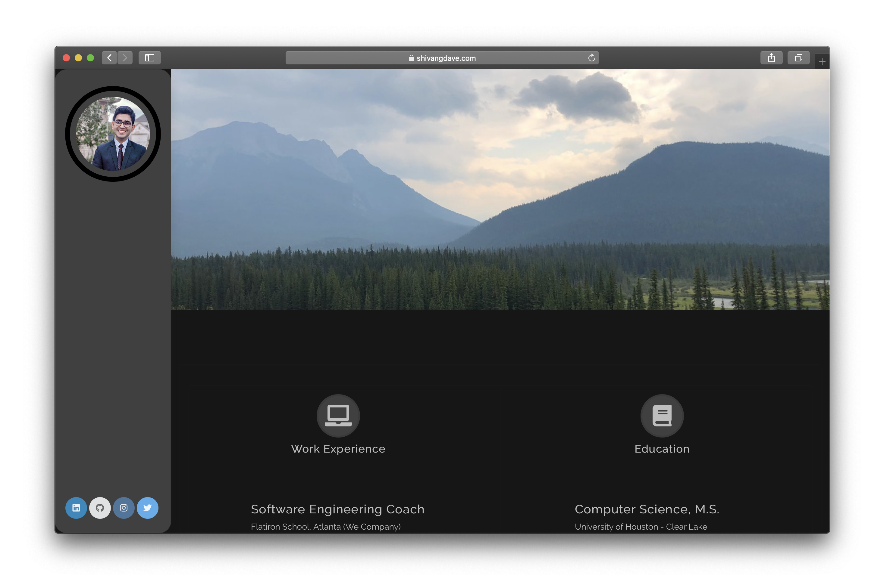
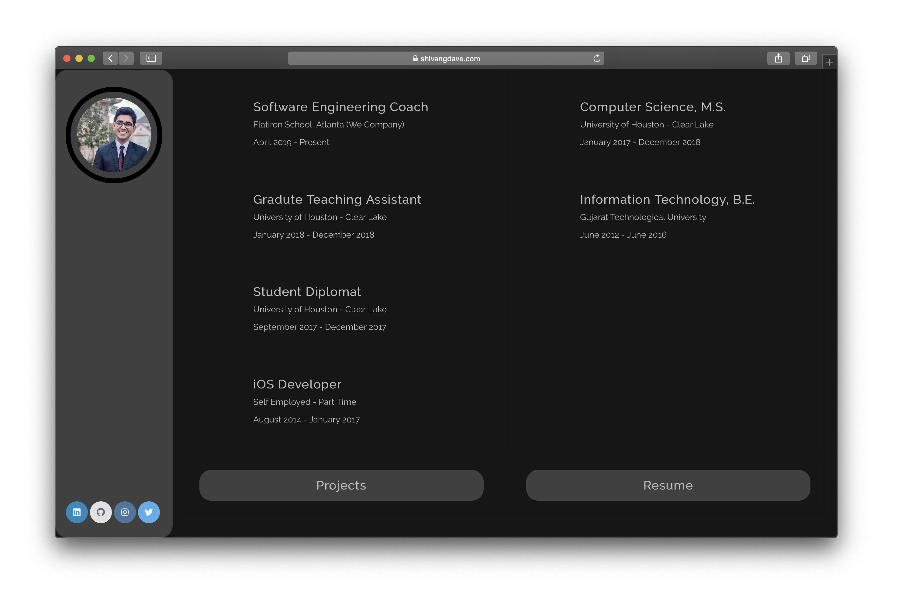
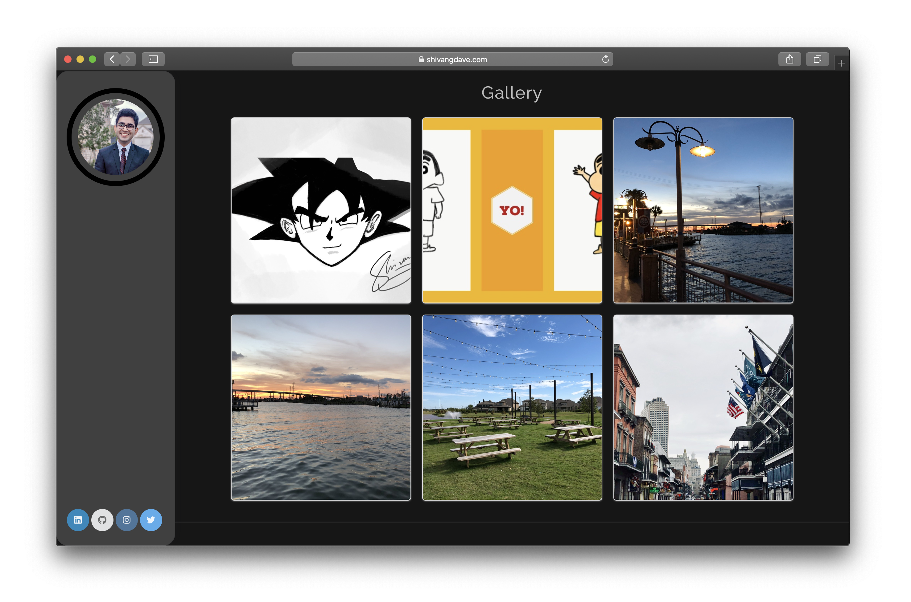
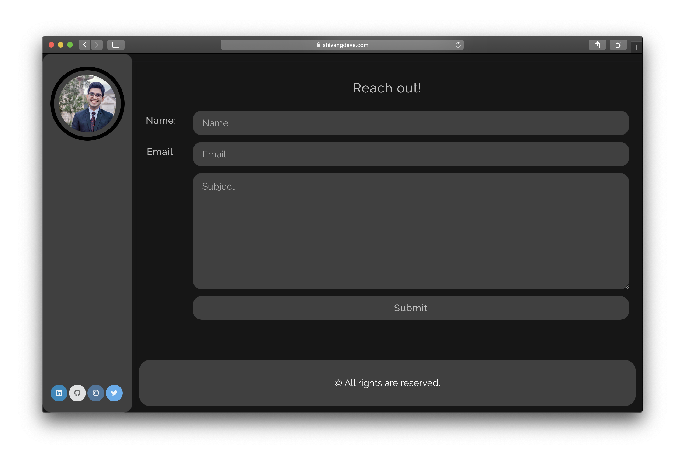

# Blog Web App

- [x] Language: React + Redux
- [x] Platform: Web
- [x] Database: Postgresql
- [x] Styling Framework: Semantic UI React + Custom CSS
- [x] Cloud Bucket: Google Cloud Platform
- [x] Backend: Rails RESTFul API
- [x] Additional:
  - [x] Backend Hosting - DigitalOcean Droplet
  - [x] Server Config - Nginx Reverse Proxy
  - [x] Auto Deploy in Production- GitHub Hooks + Bash Scripts
  - [x] SSL Certificate

### Screenshots:

